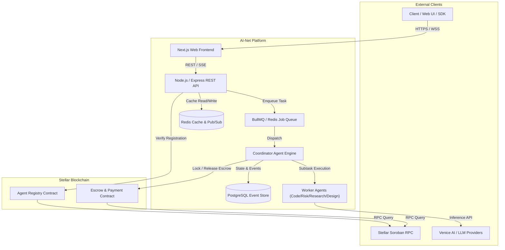
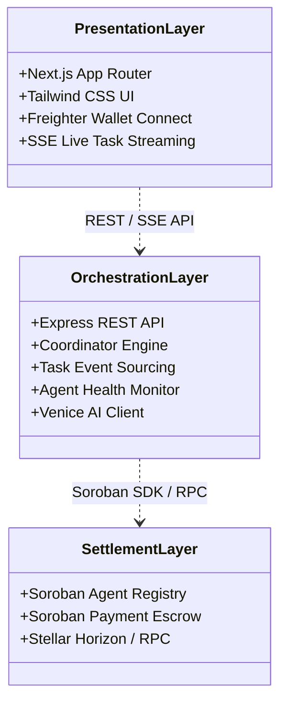
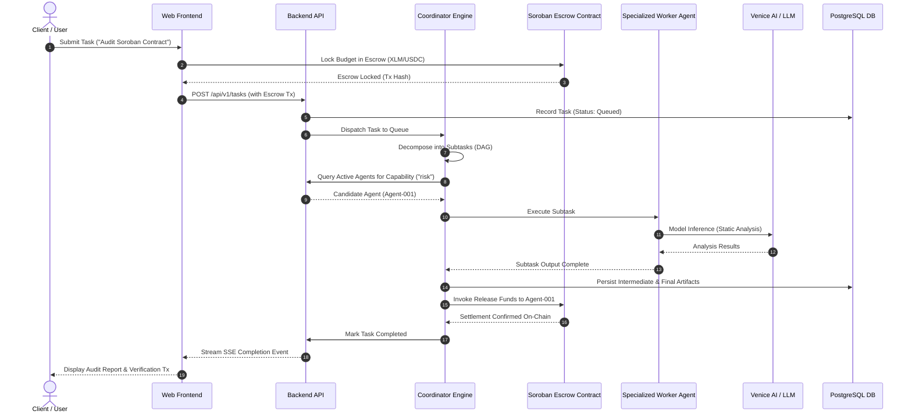
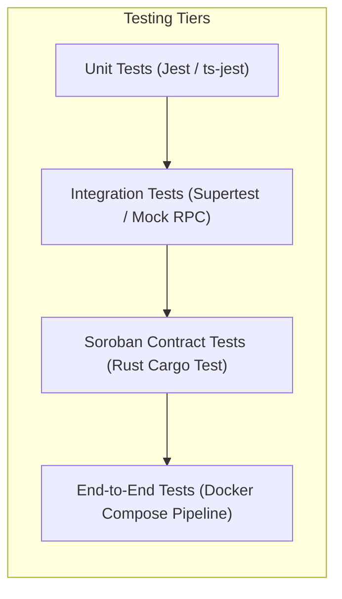

# 🏛️ AI-Net Architecture Specification & Technical Design

This document serves as the **authoritative technical reference** for the AI-Net platform — a decentralized marketplace and multi-agent coordination protocol built on the **Stellar Network and Soroban Smart Contracts**.

---

## 1. System Context & Overview

AI-Net coordinates specialized autonomous AI agents (Coding, Research, Risk, Design, and Reporting) to execute complex, multi-step workflows. Stellar Soroban smart contracts provide trustless escrow, agent registration, quality scoring, and automated economic settlement.



---

## 2. Layer Responsibilities & Component Architecture

AI-Net is partitioned into three decoupled layers:



### 2.1 Layer Breakdown

1. **Presentation Layer (`frontend/`)**:
   - Next.js 14 App Router, TypeScript, Tailwind CSS, Lucide icons.
   - Stellar wallet integration (Freighter) for transaction signing.
   - Real-time task execution telemetry using Server-Sent Events (SSE).

2. **Orchestration & Coordination Layer (`backend/`)**:
   - Node.js, Express, TypeScript, and BullMQ for distributed job processing.
   - **Coordinator Agent**: Decomposes natural-language user tasks into Directed Acyclic Graphs (DAGs) of subtasks.
   - **Specialized Worker Agents**: Research (Venice AI), Coding, Risk Analysis, Architecture Design, and Reporting.
   - **Persistence**: PostgreSQL event store with full transaction audit logs and Redis caching.

3. **Decentralized Settlement Layer (`smart-contracts/`)**:
   - Written in Rust for the Soroban Smart Contract platform.
   - **Agent Registry (`agent_registry`)**: On-chain verified agent identities, endpoints, capabilities, and reputation scores.
   - **Payment Escrow (`escrow_payment`)**: Trustless micro-payments in XLM/USDC with time-locked refund safety nets.

---

## 3. End-to-End Task Lifecycle Data Flow

The following sequence diagram details the full lifecycle from user submission to Soroban smart contract escrow settlement:



### 3.1 Payment Flows & Escrow Lifecycle Architecture

For detailed sequence diagrams, contract state machine matrices, dispute filing flows, and reconciliation audit loops, see the standalone [Payment Flows & Escrow Lifecycle Specification](file:///Users/apple/Documents/GitHub/ai-net/docs/architecture/payment-escrow-lifecycle.md).

* **Auction Bidding (`agent_bidding`)**: Sealed-bid commitment hashing (`SHA-256`) with composite scoring (`0.60 * Price + 0.40 * Reputation`).
* **Micro-Payment Escrow**: Trustless token locking in Soroban contract storage with explicit release and refund safety guards.
* **Dispute Resolution (`dispute_resolution`)**: Multi-step jury voting with automated bond slashing and IPFS evidence hashing.
* **Off-Chain Reconciliation**: Background worker loops for Soroban RPC event polling and PostgreSQL ledger synchronization.

---

---

## 5. Task Events — Schema & Cursor-Resume Contract

### 5.1 task_events DDL

The `task_events` table is the append-only event log for every task lifecycle
event.  It is the single source of truth defined in exactly one place:

```
backend/src/db/migrations/tasks/005_replace_task_events_schema.up.sql
```

The canonical DDL (also in `backend/src/db/events.sql` for documentation):

```sql
CREATE TABLE IF NOT EXISTS task_events (
  global_seq  INTEGER PRIMARY KEY AUTOINCREMENT,
  task_seq    INTEGER NOT NULL,
  version     INTEGER NOT NULL DEFAULT 1,
  type        TEXT    NOT NULL,
  task_id     TEXT    NOT NULL,
  node_id     TEXT,
  occurred_at TEXT    NOT NULL,
  payload     TEXT,
  UNIQUE (task_id, task_seq)
);

CREATE INDEX IF NOT EXISTS idx_events_task_seq    ON task_events (task_id, task_seq ASC);
CREATE INDEX IF NOT EXISTS idx_events_occurred_at ON task_events (occurred_at ASC);
CREATE INDEX IF NOT EXISTS idx_events_type        ON task_events (type, occurred_at ASC);
```

| Column | Type | Description |
|---|---|---|
| `global_seq` | INTEGER PK AUTOINCREMENT | Globally-ordered row id. Used for cross-task ordering and CDC. |
| `task_seq` | INTEGER NOT NULL | Per-task monotonic cursor starting at 0. Assigned by the EventBus. |
| `version` | INTEGER DEFAULT 1 | Payload schema version. Consumers branch on this value. |
| `type` | TEXT NOT NULL | Event type discriminator (PascalCase, e.g. `NodeStarted`). |
| `task_id` | TEXT NOT NULL | The task this event belongs to. |
| `node_id` | TEXT | The DAG node (NULL for task-level events). |
| `occurred_at` | TEXT NOT NULL | ISO-8601 wall-clock timestamp set by the emitter. |
| `payload` | TEXT | JSON-serialised event-specific payload (may be NULL). |

The `UNIQUE (task_id, task_seq)` constraint ensures duplicate appends are
detected immediately at the database layer.

### 5.2 Cursor-Resume Contract

WebSocket clients connect to `ws://<host>/tasks/:id/stream?lastEventId=<seq>`.

- `seq` is the per-task `taskSeq` value from the last event the client received.
- On reconnect the server calls `eventStore.listByTaskSince(taskId, lastEventId)`,
  which returns all events with `task_seq > lastEventId` in ascending order.
- New events are emitted to live subscribers; each flush deduplicates via
  `lastSentSeq` so nothing is delivered twice.
- If `lastEventId` is absent the client receives a full replay (equivalent to
  `lastEventId = -1`).

```
client                      server
  │                            │
  │  ws://…/tasks/X/stream     │
  │  ?lastEventId=3            │
  │ ─────────────────────────► │
  │                            │  listByTaskSince('X', 3)
  │                            │  → [seq=4, seq=5]
  │ ◄──────────────────────── seq=4
  │ ◄──────────────────────── seq=5
  │                            │  (live events arrive)
  │ ◄──────────────────────── seq=6
```

### 5.3 Schema Versioning

Every event record carries a `version` field (integer, ≥ 1).  Schema rules:

- Adding a new **optional** field does NOT require a version bump.
- Removing, renaming, or changing the type of a field requires a version bump.
- Consumer code must guard version-specific fields: `if (event.version >= 2) { … }`.

Payload schemas are validated at append time via `src/events/schemaRegistry.ts`.
A malformed payload (wrong type, missing required field, unknown version) throws
immediately rather than silently persisting a corrupt event.

See `docs/EVENTS.md` for the full per-version payload specifications.

## 4. Multi-Tier Security & Testing Strategy



* **Contract Invariants**: Every financial transition requires cryptographic signature authorization (`require_auth()`).
* **Circuit Breakers**: Venice AI and external LLM connectors implement fail-fast circuit breakers with exponential backoff.
* **Idempotency**: All task dispatch and payment webhooks enforce deduplication keys stored in Redis.
